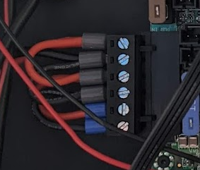

# Ender5p_Archim2_Klipper
Documentation on using an Archim 2 board and Klipper to drive an Ender 5 Plus

# Mounting And Parts Required
## Enclosure Modification

## Mounting Plate
Mounting Plate Stl File Here.
Use Whatever means nesessary to cut holes in the side of the metal box.  I drilled pilot holes and used a metal mibbler to cut away as needed.  It's not pretty, but it works!

## Parts List
* Printed mounting plate
* Archim 2 Board with accessory wiring and sparts https://ultimachine.com/products/archim2
* Raspberry P 4 (or a 3 shuld work just fine too)
* RepRapDiscount 12860 Display https://www.amazon.com/gp/product/B01FH8KTZU/
* Printed Display Housing
* Dupont Connectors and Crimp Tool https://www.amazon.com/gp/product/B07ZK5F8HP/
* Wire Ferrules https://www.amazon.com/gp/product/B073TZ5BBG/
* Short USB Jumper https://www.amazon.com/gp/product/B000E5BKQE/
* 

# Display
For whatever reason, you have to reverse the black plastic co

# Wiring
The most tedius part of this conversion was crimping new ends onto many of the cables to work with the archim board.  The crealty board uses JXT/JST connectors for most stuff, and the Archim (as well as the Ultimachine Rambo boards) use _ connectors, whech are compatible with standard Dupont Pin connectors.

## Power Wiring
All three sets of power connectors should be connected to the power supply, but a large current connection isn't needed for the heated bed since we have a separate transistor switching power to the bed.

## Stepper Wires

## Fans

## Endstops

## Thermistors

## BLTouch Sensor

# Klipper Config

# Reference Links
* Archim Schematic and Pinouts
** https://reprap.org/wiki/Archim2
* How to wire the BLTouch with Archim 2
** https://github.com/radensb/BLTouch-Installation-Guide-Archim2
